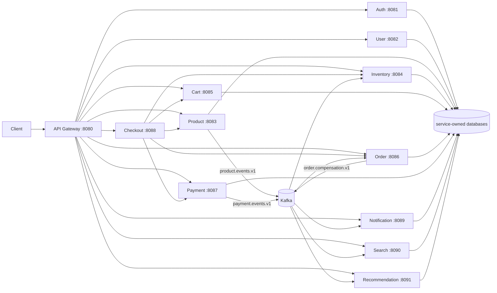

# Microservices Commerce Platform

A portfolio-scale commerce backend demonstrating service-owned data, synchronous orchestration,
event-driven projections and compensation, gateway security, observability, containerization, and
a local Kubernetes deployment. The repository contains 12 Java 21 / Spring Boot services, shared
contracts, PostgreSQL, Kafka, Docker Compose tooling, Kustomize manifests, and GitHub Actions CI.

> This is a production-inspired reference implementation, not a production-ready commerce system.
> Its deliberate limitations are documented below and in the architecture documentation.

## Architecture at a glance



The complete topology, ownership model, checkout sequence, event flows, and deployment boundaries
are in [System overview](docs/architecture/system-overview.md).

## Implemented capabilities

- JWT registration/login/refresh/logout and gateway authentication, role checks, CORS, and trusted
  identity headers.
- User profiles and addresses; product, category, brand, image, and attribute management.
- Persistent carts, inventory reservation/release, order lifecycle, payment lifecycle, and a
  synchronous checkout orchestrator with best-effort compensation.
- Transactional outboxes and at-least-once Kafka delivery for payment outcomes, inventory-release
  compensation, and product catalogue changes.
- Independent notification, PostgreSQL full-text search, and deterministic content-based
  recommendation read models with deduplication and stale-event protection.
- Prometheus metrics, correlated structured logs, Loki/Grafana, and Tempo/OpenTelemetry tracing in
  the Docker Compose environment.
- Non-root multi-stage images, a 12-service local Kubernetes baseline, Kustomize validation, and
  Maven/GitHub Actions build automation.

## Service map

| Service | Port | Database | Primary responsibility |
|---|---:|---|---|
| API Gateway | 8080 | none | Routing, JWT validation, authorization, CORS, resilience |
| Auth | 8081 | `auth_db` | Credentials, access tokens, refresh-token rotation |
| User | 8082 | `user_db` | Profiles, addresses, preferences |
| Product | 8083 | `product_db` | Catalogue and product-event outbox |
| Inventory | 8084 | `inventory_db` | Stock and reservations; compensation consumer |
| Cart | 8085 | `cart_db` | Persistent carts and line items |
| Order | 8086 | `order_db` | Order lifecycle, payment consumer, compensation outbox |
| Payment | 8087 | `payment_db` | Payment lifecycle and payment-event outbox |
| Checkout | 8088 | none | Synchronous commerce workflow orchestration |
| Notification | 8089 | `notification_db` | Durable internal notification projection |
| Search | 8090 | `search_db` | Product search projection and query API |
| Recommendation | 8091 | `recommendation_db` | Related-product projection and ranking |

## Quick start

Prerequisites: JDK 21, Maven 3.9+, and Docker Compose.

```bash
mvn test
mvn package -DskipTests
docker compose -f tests/end-to-end/compose.yml up -d
```

The base Compose stack starts PostgreSQL and all services. Kafka-backed flows are opt-in:

```bash
docker compose -f tests/end-to-end/compose.yml \
  -f infrastructure/kafka/compose.kafka.yml up -d
```

Add the Prometheus, logging, or tracing overlays described in
[Observability](docs/architecture/observability.md). Local Kubernetes instructions are in
[Kubernetes deployment](docs/deployment/kubernetes.md).

## Validation

```bash
mvn test
mvn package -DskipTests
kubectl kustomize infrastructure/kubernetes/overlays/local >/tmp/commerce.yaml
git diff --check
```

The Maven reactor includes unit and integration tests. Running-service checkout scenarios require
`-De2e.base=true`; Kafka-backed scenarios have separate opt-in flags. See
[Test strategy](docs/testing/test-strategy.md) and [E2E guide](tests/end-to-end/README.md).

## Documentation

Start with the [documentation index](docs/README.md), [system overview](docs/architecture/system-overview.md),
and [project summary](docs/project-summary.md). Per-service API/database references and architecture
decision records document the contracts and tradeoffs in detail.

## Known limitations

- The payment provider and notification delivery channels are simulated; no money, email, or SMS
  leaves the platform.
- Gateway security is not duplicated in downstream services. Directly exposed service ports bypass
  it, and several opaque resource identifiers still need service-level ownership checks.
- Kafka delivery is at-least-once, outbox/DLT tables have no retention jobs, and search/recommendation
  bootstrap is limited by topic retention.
- The Kubernetes stack is a single-node development baseline: one PostgreSQL instance, one ephemeral
  Kafka broker, development secrets, no TLS/Ingress, no autoscaling, and no cloud deployment.
- There is no frontend, shipping/tax/discount subsystem, HA design, alerting, or automated release.

These boundaries are intentional and are summarized with next steps in
[Project summary](docs/project-summary.md).
