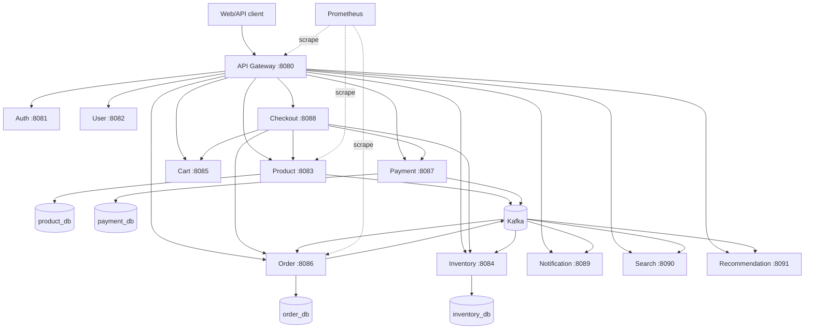
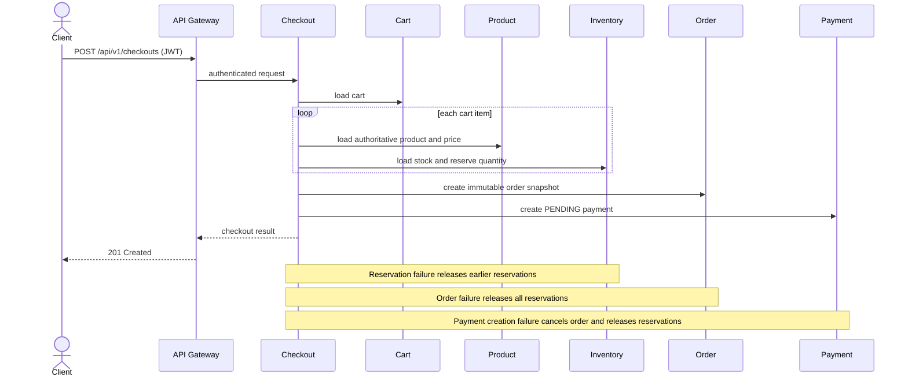
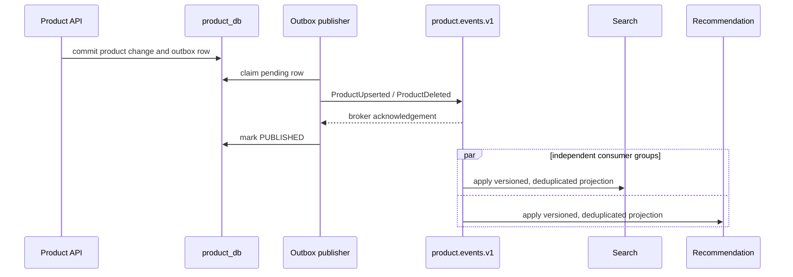

# System overview

## Purpose and boundaries

The platform is a modular commerce backend built as 12 independently deployable Spring Boot
applications. Each stateful service owns its schema and Flyway migrations; no service reads another
service's tables. The API Gateway is the external HTTP boundary. Checkout coordinates the immediate
customer workflow over HTTP, while Kafka carries durable follow-up work and read-model updates.

## Service and data ownership

| Service | Port | Owned database | Responsibility | Direct dependencies |
|---|---:|---|---|---|
| API Gateway | 8080 | — | Routes APIs; validates JWTs; applies authorization, CORS, and HTTP resilience | all routed services |
| Auth | 8081 | `auth_db` | Credentials, roles, access tokens, refresh-token rotation/revocation | — |
| User | 8082 | `user_db` | Profiles, addresses, preferences | — |
| Product | 8083 | `product_db` | Catalogue; transactional product-event outbox | Kafka |
| Inventory | 8084 | `inventory_db` | Available/reserved stock; inventory compensation | Kafka |
| Cart | 8085 | `cart_db` | One persistent cart per user and line items | — |
| Order | 8086 | `order_db` | Order snapshots/lifecycle, payment consumer, compensation outbox, payment DLT operations | Kafka |
| Payment | 8087 | `payment_db` | Payment state machine; transactional payment-event outbox | Kafka |
| Checkout | 8088 | — | Synchronous Cart → Product → Inventory → Order → Payment orchestration | five domain services |
| Notification | 8089 | `notification_db` | Idempotent internal notification projection from payment outcomes | Kafka |
| Search | 8090 | `search_db` | Eventually consistent PostgreSQL full-text/trigram product projection | Kafka |
| Recommendation | 8091 | `recommendation_db` | Eventually consistent product projection and deterministic related-product ranking | Kafka |

UUID references cross service boundaries without cross-database foreign keys. Checkout has no
database: its success response reflects calls completed during that request, not a durable workflow
record.

## System topology

The diagram abbreviates database and metrics edges; the ownership table is authoritative.

## Synchronous checkout flow

Compensation in this request is best-effort. Later payment authorization/failure is asynchronous:
Order confirms/cancels from the payment event, and a cancelled order emits an inventory-release
request through its own outbox.

## Product event flow

## Messaging contracts

| Topic | Producer | Consumers | Purpose |
|---|---|---|---|
| `payment.events.v1` | Payment outbox | Order, Notification | Confirm/cancel orders and record internal notifications |
| `payment.events.v1.DLT` | Order error handler | Order DLT store/replay | Rejected payment events for operations |
| `payment.events.v1.notification.DLT` | Notification error handler | operator inspection only | Rejected notification inputs |
| `order.compensation.v1` | Order outbox | Inventory | Release reservations after payment-driven cancellation |
| `order.compensation.v1.DLT` | Inventory error handler | operator inspection only | Rejected compensation inputs |
| `product.events.v1` | Product outbox | Search, Recommendation | Maintain independent catalogue projections |
| `product.events.v1.search.DLT` | Search error handler | operator inspection only | Rejected search projection inputs |
| `product.events.v1.recommendation.DLT` | Recommendation error handler | operator inspection only | Rejected recommendation inputs |

Delivery is at-least-once. Producers reuse stable event IDs; consumers claim those IDs in their own
database transaction and apply source-version guards where ordering matters. A broker acknowledgement
and subsequent outbox status update are not atomic, so duplicates are expected and safe.

## Gateway and security

The gateway routes every public API. Auth registration/login/refresh and selected read-only catalogue,
search, and recommendation routes are public. Other routes require an HS256 access token issued by
Auth Service; catalogue mutations and `/api/v1/admin/**` require `ADMIN`. The gateway strips
client-supplied identity headers and supplies trusted user/role headers from the token.

This is an ingress boundary, not end-to-end service security. Downstream applications do not validate
JWTs, so only the gateway should be externally exposed. Ownership checks for APIs addressed by opaque
cart/order/payment/notification IDs remain incomplete. See [Security model](../security/security-model.md).

## Search, recommendations, and notifications

Search uses a service-owned PostgreSQL projection with `tsvector` ranking and `pg_trgm` substring
matching; it does not query Product Service synchronously. Recommendation uses another projection and
deterministic content rules (category, brand, and price proximity), not ML or purchase popularity.
Both are eventually consistent, independently consume `product.events.v1`, deduplicate events, ignore
stale versions, and preserve deletion tombstones.

Notification Service independently consumes payment events and stores one `INTERNAL`, `CREATED`
record per event. `CREATED` means recorded, not delivered; no email/SMS provider is integrated.

## Observability

All services expose health and Prometheus endpoints, tag metrics with a stable application name, and
emit trace-correlated logs. Compose overlays add Prometheus, Grafana/Loki/Promtail, and Tempo. HTTP
traces use OpenTelemetry; Kafka observations propagate W3C context. An outbox is a deliberate trace
boundary because originating context is not persisted. Kubernetes deploys only Prometheus and disables
OTLP export. See [Observability](observability.md).

## Kubernetes deployment model

Every service has a non-root Java 21 multi-stage image. The local Kustomize overlay deploys 12
Deployments/ClusterIP Services, one PostgreSQL 17 StatefulSet with ten logical databases/users, one
single-node ephemeral KRaft Kafka broker, and Prometheus. Only the gateway becomes a LoadBalancer.
Secrets are development placeholders generated by the overlay. This is a local validation baseline,
not HA or cloud production; see [Kubernetes deployment](../deployment/kubernetes.md).
